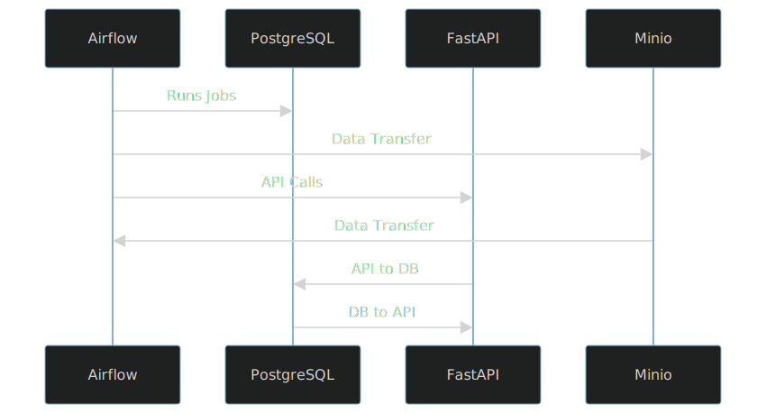

# Data Pipeline Coding Challenge

## Overview

This repository contains the codebase for a data pipeline coding challenge that includes Airflow DAGs, API endpoints, and database models.

## Table of Contents

- [Overview](#overview)
- [Getting Started](#getting-started)
  - [Prerequisites](#prerequisites)
  - [Installation](#installation)
- [Architecture](#architecture)
  - [Postgres](#postgres)
  - [Airflow](#airflow)
  - [FastAPI](#fastapi)
  - [MinIO](#minio)
  - [Design patterns](#design-patterns)
  - [Ways to Improve](#ways-to-improve)
- [Usage](#usage)
  - [Airflow DAGs](#airflow-dags)
  - [API Endpoints](#api-endpoints)
- [Testing](#testing)

## Getting Started

### Prerequisites

- Docker
- Python 3.10
- Pipenv

### Installation

1. Clone the repository
   ```
   git clone https://github.com/jose1522/data_pipeline.git
   ```
2. Navigate to the project directory
   ```
   cd data_pipeline
   ```
3. Start the services
   ```
   make start-services
   ```
## Architecture



### Postgres
Stores the data. It is exposed to the API and Airflow via a Docker container.
- Advantages: ACID compliance, extensibility, and strong community support.
- Disadvantages: Can be resource-intensive for large datasets.
- Why Chosen: For its reliability and feature-rich nature.

### Airflow
Performs data backups and restorations, and interacts with the API for bulk inserts of csv files. It also interacts with Minio for data storage.
- **Advantages**: Scalability, robust scheduling, and a rich set of integrations.
- **Disadvantages**: Complexity in setup and resource-intensive.
- **Why Chosen**: For its powerful scheduling and orchestration capabilities.

### FastAPI
Exposes RESTfull endpoints to that interact with Postgre models and are called by Airflow.

- Advantages: Fast, built-in data validation, and auto-generates OpenAPI documentation.
- Disadvantages: Newer, thus less mature in the ecosystem.
- Why Chosen: For its speed and modern Pythonic API design.

### MinIO
Object storage solution that stores files and interacts with Airflow for data transfer. This is a substitute replacement for a cloud blob storage.

- Advantages: High performance, easy to deploy, and S3-compatible.
- Disadvantages: Limited features compared to full-fledged cloud storage solutions.
- Why Chosen: For its simplicity and performance in object storage.

### Design patterns
#### Repository Pattern
- Purpose: To decouple the application logic from the database, making it easier to switch databases or mock database calls during testing.
- Advantages: Simplifies testing, improves code reusability, and allows for easier maintenance.
- Disadvantages: Adds an extra layer of abstraction, which can complicate simple CRUD operations.

#### Dependency Injection
- Purpose: To inject dependencies like database sessions or caching services dynamically.
- Advantages: Easier testing, better modularity, and separation of concerns.
- Disadvantages: Can make the code harder to follow if overused.

#### Singleton Pattern
- Purpose: To ensure that a class has only one instance and provides a global point to access it, useful for database connections.
- Advantages: Efficient use of resources, ensures consistency.
- Disadvantages: Global state can make testing challenging.

### Ways to Improve

#### 1. Switch to CockroachDB
- **Purpose**: Enhance scalability and fault tolerance.
- **Advantages**: Horizontal scalability, strong consistency.
- **Challenges**: Complexity in setup, consistency-latency trade-offs.

#### 2. Implement CDC and Kafka
- **Purpose**: Enable event-driven architecture and real-time analytics.
- **Advantages**: Real-time data propagation, decoupling of services.
- **Challenges**: Managing event schemas, ensuring data consistency.

#### 3. Secrets Storage (Vault)
- **Purpose**: Securely manage secrets.
- **Advantages**: Centralized secret management, fine-grained access control.
- **Challenges**: Initial setup complexity, ongoing management.

#### 4. Authentication Microservice with RBAC
- **Purpose**: Secure the API and manage roles and permissions.
- **Advantages**: Improved security, modular authentication.
- **Challenges**: Complexity in managing roles, potential for security loopholes.

#### 5. Live Monitoring and Logging
- **Purpose**: Real-time tracking of system health.
- **Advantages**: Faster issue identification, better system insights.
- **Challenges**: Storage and management of logs, alert noise.

#### 6. Other General Improvements
- Implement Caching
- Optimize Database Queries
- Improve CI/CD Pipeline

## Usage

### Airflow DAGs

- `bulk_insert.py`: This is used to bulk insert data into the database. It is triggered manually.
- `database_backup.py`: This is used to backup the database to a file in AVRO format. It is triggered manually.
- `database_restore.py`: This is used to restore the database from a file in AVRO format. It is triggered manually.

### API Endpoints

- `localhost:8000/v1/department`: Supports GET, POST, PUT, and DELETE requests, as well as bulk inserts via POST.
- `localhost:8000/v1/job`: Supports GET, POST, PUT, and DELETE requests, as well as bulk inserts via POST.
- `localhost:8000/v1/user`: Supports GET, POST, PUT, and DELETE requests, as well as bulk inserts via POST.
- `localhost:8000/v1/report`: Supports GET requests. Outputs csv files

## Testing

Make sure you have initialized the virtual environment and installed the dependencies.
```
make create-venv
```

Run the tests using the following command:

```
make run-tests
```
